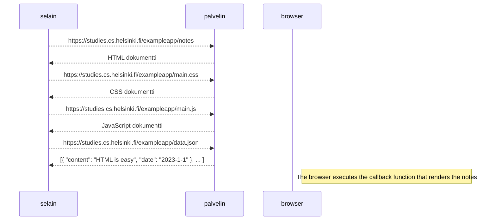

```mermaid
sequenceDiagram
    participant selain
    participant palvelin

    selain-->>palvelin: https://studies.cs.helsinki.fi/exampleapp/notes
    palvelin-->>selain: HTML dokumentti

    selain-->>palvelin: https://studies.cs.helsinki.fi/exampleapp/main.css
    palvelin-->>selain: CSS dokumentti

    selain-->>palvelin: https://studies.cs.helsinki.fi/exampleapp/main.js
     palvelin-->>selain: JavaScript dokumentti

    selain-->>palvelin: https://studies.cs.helsinki.fi/exampleapp/data.json
    palvelin-->>selain: [{ "content": "HTML is easy", "date": "2023-1-1" }, ... ]
Note right of browser: The browser executes the callback function that renders the notes 
```

